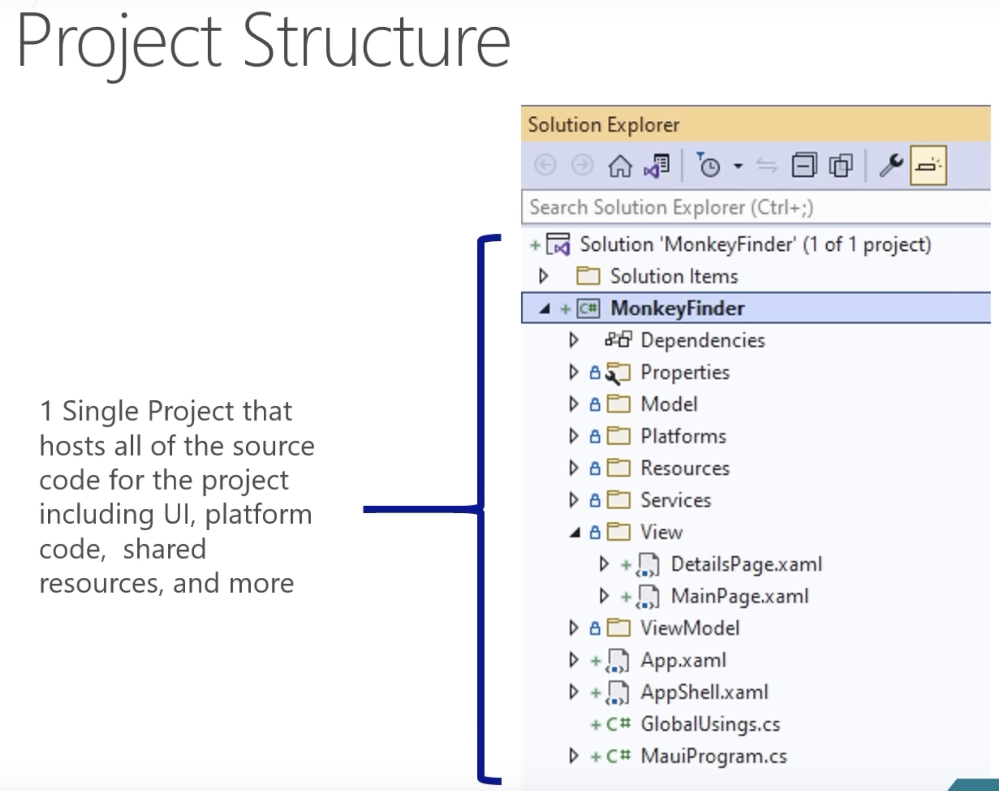

# Learn .NET MAUI - Full Course for Beginners by [James Montemagno](https://montemagno.com/)

- Video - [https://www.youtube.com/watch?v=DuNLR_NJv8U&list=PLwOF5UVsZWUjNR3roRK79QgBcKLyOX48I&index=17](https://www.youtube.com/watch?v=DuNLR_NJv8U&list=PLwOF5UVsZWUjNR3roRK79QgBcKLyOX48I&index=17)
- Code - [aka.ms/maui-workshop](https://aka.ms/maui-workshop)

## Intro

- Typically I will go deep in the innerworkings of the framework, but instead that is in [this video](https://www.youtube.com/watch?v=KmLQLSKqvvI&list=PLwOF5UVsZWUjNR3roRK79QgBcKLyOX48I)

**Agenda!**

- Building Our First App
- MVVM & Data Binding
- Navigation
- Accessing Platform Functionality
- Displaying Data
- App Themes

## Building Our First App

### Project Structure

- Everything inside a Maui application is a single-project

#### Flyover of Concepts

- Resources Folder (images, fonts, etc.)
- Platforms
- csproj file (settings for compiling)
- conditional compilation (for env or platform)
- Events (Application & window events)
- Shell (https://www.youtube.com/watch?v=dM4PhZAUhzU)
- Pages
- Layouts (Grid, FlexLayout, etc.)
