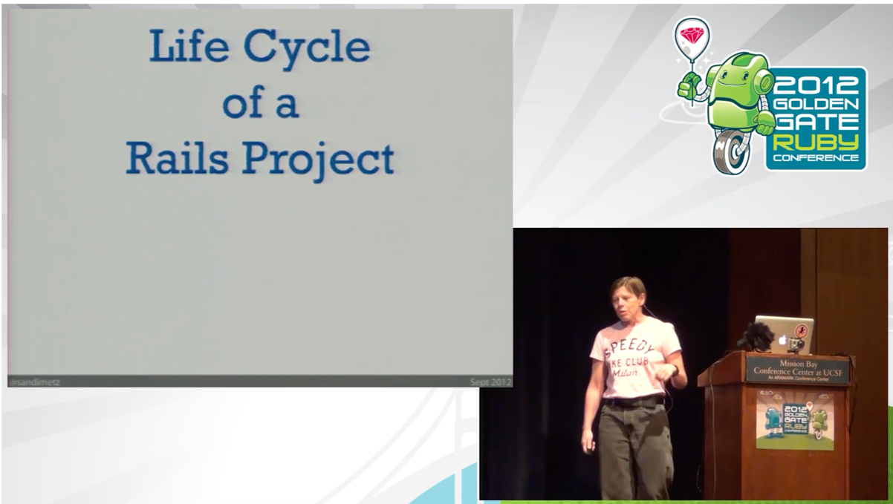
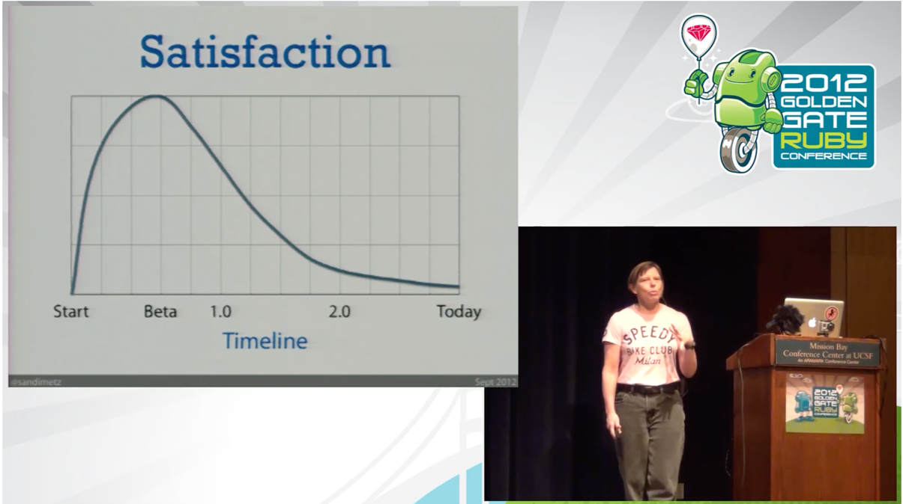
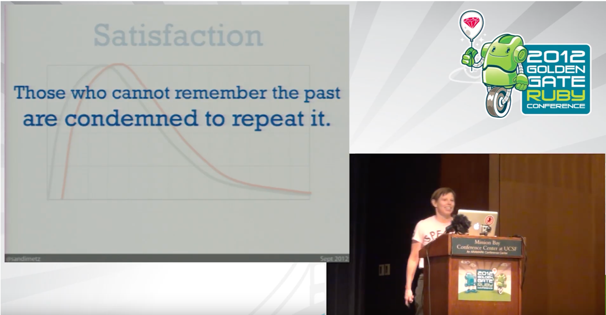
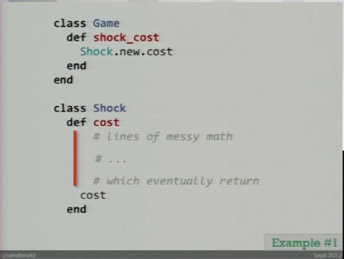
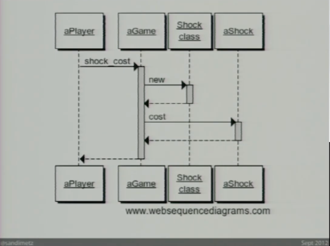

# Go Ahead Make a Mess by Sandi Metz

[https://www.youtube.com/watch?v=xi3DClfGuqQ](https://www.youtube.com/watch?v=xi3DClfGuqQ)

## Intro

### Life Cycle of a Rails Project

1. 
- You write an app and everyone thinks your a genius
- Then... the Customer asks for a change.
- And you make that change, and you make a few other changes. And it's really not that bad.
- Then you fling it all into Production!
- And you still feel happy and smart.

2.
- Then, the Customer changes their mind! They didn't actually want _that_ thing, they wanted another thing
- And you get into your code editor and make about 50 changes, and tests are broken.
- You put all the code back together.
- Then you deploy it.

3.
- Then they ask for a new feature -- and of course, it's due tomorrow.
- So you just start beating at it with a machete. 
- You do every possible hack, you make every crappy decision.
- And in the end you're just trying to figure out how you can get the code checked in without putting your name on it!

4.
- And one day you wake up and you realize you hate this app, you hate Rails, you hate Ruby, and you hate your life!

### Satisfaction

`"You were fast now you're slow, you were happy now you're sad, you were cost effective and now you're a money pit! The app was amazing and now it's just a mess. And this does not mean that it's time to look for a new job."`

🔥 `"Unless you do something different you are going to end up hating every app you've ever write."`

🔥 `"These applications are prisoners of their designs and they're holding you hostage."`

You have to learn to understand "The Mess"...

## The Mess

You're app is like a tapestry... So interwoven together..

But it's not like this furry scene with these little lambs

No you're app is trying to kill you!

Can't pull on something without breaking others...

### Knowledge

- Issues stem from "knowledge". Objects that know about each other.

### Dependencies

- Something that changes when you need to change another thing. They need to talk!
- However, you can easily arrange your dependencies so that things turn out badly!

### Stability

- Controlling dependencies requires understanding the stability of the various bits of knowledge in your app
- Every bit of information that an object knows can be ranked along a continuum from completely stable to completely unstable
- 🔥 `"And it doesn't actually matter how stable any individual thing is, it just needs to be more stable than the things that depend on it. Stability is relative, and things that seem wildly unstable from certain points of view are perfectly dependable from others."`
- And... Sometimes we don't know _how_ stable things are

### Hope

- But this is where Object-Oriented Design gives us "Hope"!
- It is the ultimate dispenser of programming "treats."
- It knows how to separate the stable from the unstable, and it allows you to depend on the first and hide the second.
- It explains confusing things and its like a light for you in the "dark places" of your app
- And it gives you a way to arrange "The Mess" so that you can write apps that are fun forever.
- It changes everything!
- 🔥 `"Design lets you stop worrying and learn to love the mess"`

## Code Examples

### Label the Knowledge - Example #1

#### Omega Mess

- Call this an "Omega Mess."
- It is at the end of the line, has no dependencies and no dependants.
- Should we leave it, or change it? What are the consequences of walking away right now?

### Complicate the Code - Example #2

### Isolate the Instability - Example #3

### Manage the Mess
