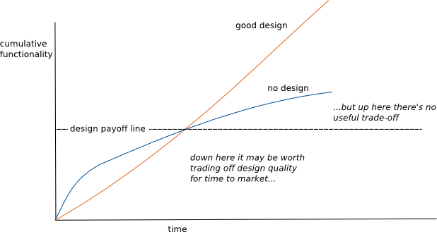

# SOLID Object-Oriented Design by Sandi Metz

[https://www.youtube.com/watch?v=v-2yFMzxqwU&list=PLqal2KPbpmUwQurG_ixyT9pAHcesUjvJ5&index=7](https://www.youtube.com/watch?v=v-2yFMzxqwU&list=PLqal2KPbpmUwQurG_ixyT9pAHcesUjvJ5&index=7)

# Intro

- Dependencies are killing you! ⚔️
    - But... **Design might save you** 🦸
- The [Design Stamina Hypothesis](http://www.martinfowler.com/bliki/DesignStaminaHypothesis.html) says that, after a certain point, you’ll have done better if you had designed first.

    
    

❗The goal here is to have maintainable code.

# To avoid dependencies your code should be

- loosely coupled
- highly cohesive
- easily composable
- context independent

👆 All of this is about strategies to achieve independence

# Achieving Independence

Let's talk about these from the bottom-up, and then throw some out to make it easier for us

- Single Responsibility
- Dependency Inversion
- **💡Open/Closed (Open for extension, closed for modifications)**
    - The main thing I want to focus on today is achieving open/closed, through applying single-responsibility and dependency injection...
- ~~Liskov Substitution~~
    - Child classes can be substituted for their parent
- ~~Interface Segregation~~
    - Really important for statically typed languages like C++. In a dynamically typed languages like Ruby, these languages obey this principle in the most extreme way possible by their very nature.
    - 

# Let's write some code...

### Ground Rules

- Only mock classes I own
- Don't mock/stub the object under test

## 1. Starting Code - Does it work?

- "This code doesn't tolerate change!"
- Should we refactor just because we can? Or should I just stop now?

### 🔥"Resistance is a Resource"

- Don't be attached to your first idea
- Embrace the friction
- Fix the problem
- 💬 In this case, I want to listen to the code smell even though I don't really know how to articlate what is going wrong and I don't know where I'm going.
- 💬 I know that something is not right and I believe in the rules.
- 💬 If testing seems hard - examine your design.

### 🔥 **Tests**

- Tests depend upon the design of the code
- TDD will punish you if you don't understand design.
- When testing told to:
    - Red - Green - Refactor
    - Then ask questions (correct answer is "Yes")
        - Is it DRY?
        - Does it have one responsibility?*
        - Does everything in it change at the same rate?*
        - Does it depend on things that change less often than it does?*
            - *Sandi's bonus questions

## 2. Second Pass - Does it have one responsibility?

- Why does it have more than one responsibility? And in this case is bad. Or, is even worse!

- Now, we can "mock" between Job & Downloader!

- Dependency injection 👇
    
    
    

## 3. Third Pass - Does this change at the same rate?

- This makes me uneasy because it contains a path and file name that are pretty likely to change 👇

- Side note - This is how I approach refactoring

- Next thing I want to do is pull out Patent Config
    - We don't need to mock it! Be careful of the "Mock Everything" people
    
    
    
- Tests need to change per environment
    - Sometimes while in test, we need to pretend we're in Production, that way we know it's okay in more than just test
    - She is injecting `env=Rails.env` but says we should probably never actually do that, and instead just stub it
    
    ![Luke Thought about this: I don't get bothered in the same way Sandi does by these things. I'd love to learn more about why she thinks the way she does. "But what about that? This is an if-statement. And if another environment appears you can bet your bottom dollar I'm going to have to change this code. It is a code smell in any Object-Oriented Class if you have an if-statement. [...] As an Object I ought to know what kind of thing I am, and I ought to do the right thing because of what I am." - Sandi.](Untitled%2010.png)
    
    Luke Thought about this: I don't get bothered in the same way Sandi does by these things. I'd love to learn more about why she thinks the way she does. "But what about that? This is an if-statement. And if another environment appears you can bet your bottom dollar I'm going to have to change this code. It is a code smell in any Object-Oriented Class if you have an if-statement. [...] As an Object I ought to know what kind of thing I am, and I ought to do the right thing because of what I am." - Sandi.
    

### 🔥"You don't have to know where you're going to successfully refactor"

- "Refactor, not because you *know* the abstraction, but because you want to *find* it."
- If you haven't done this very much, when we see really nicely factored code we may feel like a dummy and just want to give up. *I could never do that! Look how beautiful that is, I could never have thought of that!*
    - The cold hard truth is, they didn't write good code to begin with! They just wrote crappy code to begin with, and then they refactored it to look good.
- You have that exact same ability to right good code!
- Good code happens because we know the rules, have faith in them to apply them over and over, and then you end up with good code.

- `patent.yml` leads us to a place where our code is not dry

- 👆We can absolutely rely on this and never worry about if these methods are here or not

## 4. Names (quick)

- Change PatentDownload to FTP Downloader
    - Not special

🎊 It feels like we're done! But what about "Does it depend on things that change less often than it does?"

## 5. Change - Does it depend on things that change less often than it does?

- Is it right that things that change a lot are depending on things that don't?

- So put things on a scale 👇

- Lower numbers are good

- This is wrong, FTPDownloader shouldn't know about this, PatentJob should: 👇

- Now the app looks like this 👆

- Now we're done right?? 🚴
    - Wrong! What's left is things change
    

## 6. Time passes... things change

- Several different jobs **AaaJobs** have been created
- Some have used SFTP instead of FTP
- Remaining FTP jobs might switch to SFTP

- Don't know the name of the class!

- So put it in the config file

- NOW WE'RE DONE!! 🎉🎉

## Summary

- TDD is not enough
    - BDD is great... but it's not enough
- DRY is not enough
- Design because you expect your application to succeed and the future to come.
- **READ THESE**
    - Robert C. Martin -
        
        [Principles_and_Patterns.pdf](Principles_and_Patterns.pdf)
        
    - Steve Freeman and Nat Pryce - [https://www.amazon.com/Growing-Object-Oriented-Software-Guided-Tests/dp/0321503627](https://www.amazon.com/Growing-Object-Oriented-Software-Guided-Tests/dp/0321503627)